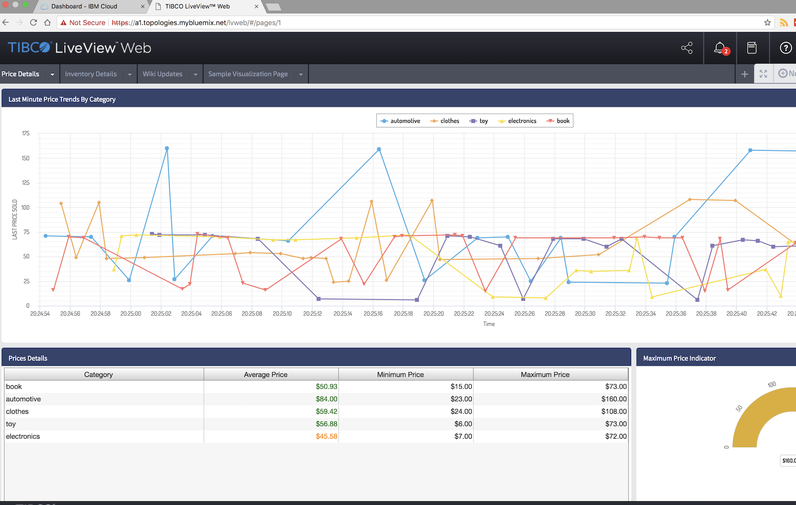

# Cloud Foundry StreamBase Application Buildpack

The `sb-buildpack` is a [Cloud Foundry](https://www.cloudfoundry.org/) custom buildpack for running StreamBase 10 applications.  It is designed to run using maven however `cf` command line is also possible.  To start, download the [StreamBase Cloud Examples](http://devzone.tibco.com/sites/streambase/latest/dtmexamples/cloud/cloud-10.2.1-src.tar.gz) and use the cloud-10.2.1/cloudfoundry/pom.xml to compile and deploy your buildpack.

Please read the Usage and Requirements sections below prior to deploying the buildpack.  For a complete description of the buildpack, goto the [Cloud Foundry Example with StreamBase 10](http://devzone.tibco.com/sites/streambase/latest/dtmexamples/cloud/cloudfoundry/index.html) site.

## Prerequisites
* Install [Cloud Foundry CLI](https://docs.pivotal.io/pivotalcf/devguide/installcf/install-go-cli.html) on your local computer
* Access to Pivotal Cloud Foundry Platform or [Pivotal Web Services](https:/pivotal.io), IBM Cloud, etc.
* If using hosted PCF like PWS, a [Github](https://github.com) account is required to stage buildpack.
* Using Maven: Java 1.8.0+, Maven 3.3.3+, Curl
* StreamBase Studio Installation on your local computer
* StreamBase Liveview Web Fragment example included in the [StreamBase Cloud Examples](http://devzone.tibco.com/sites/streambase/latest/dtmexamples/cloud/cloud-10.2.1-src.tar.gz) or your custom SB Web Application

### Create CF ORG, DOMAIN, ROUTES

Use the following CF command lines to create your org, domain, and route for the StreamBase Application prior to deployment.

```bash
cf login -u <username> -p <password> -o <org> -s <space> -a https://api.run.pivotal.io
cf create-route -s <space> lvweb.cfapps.io 
```

## Usage

Use the cf commands below for manual deployment of StreamBase Application:

```bash
cf login -u <username> -p <password> -o <org> -s <space> -a https://api.run.pivotal.io
mkdir app && cp <yoursbapp.zip> app/<yoursbapp.zip>
cd app
cf push myapp -f <path to manifest.yml>
```

To use this buildpack along with Maven, download the StreamBase Cloud Examples on your local computer with StreamBase Studio client installed. Then compile and deploy the sample StreamBase Liveview Helloworld application to Cloud Foundry.

Use the commands below for faster deployment to PWS or your own private CF API endpoint:

```bash
curl http://devzone.tibco.com/sites/streambase/latest/dtmexamples/cloud/cloud-10.2.1-src.tar.gz | tar xz
cd cloud-10.2.1/cloudfoundry/hellolvweb-app && mvn install
cf login -u <username> -p <password> -o <org> -s <space> -a https://api.run.pivotal.io
cd ../ && mvn integration-test  -DskipTests=true -DCF_TARGET=https://api.run.pivotal.io -DCF_DOMAIN=<yourapp>.cfapps.io  -DCF_SPACE=<space> -DCF_ORG=<org>  -DSB_TARBALL_URL=https://<location to sb runtime platform_linuxx86_64.zip>
```

## Examples
The following are simple examples for deploying StreamBase Application with this buildpack.

### Using Manifest file

Use the manifest file and node configuration examples below to perform your 'cf push'. By default, the startup script will deploy the StreamBase Application with the HOCON node.conf included in your app or in the ./app directory.

manifest.yml example:

```yaml
applications:
- name: A1.hellolvweb-app
  memory: 8GB
  disk_quota: 2GB
  timeout: 180
  instances: 1
  buildpack: https://github.com/TIBCOSoftware/sb-buildpack.git
  domain: lvweb.cfapps.io
  random-route: false
  host: A1
  health-check-type: port
  env: 
      SB_TARBALL: platform_linuxx86_64.zip
      SB_TARBALL_URL: https://sbruntime.s3.amazonaws.com
      SB_APP_FILE: hellolvweb-app-10.3.0-SNAPSHOT.zip
      SB_APP_NAME: hellolvweb-app
      ADMIN_PORT: 5556
      NODE_CONFIG: node.conf
      NODENAME: A1.hellolvweb-app
      BUILDTYPE: PRODUCTION
      SUBSTITUTIONS: GOLDYLOCKS_EPPORT=10000
      TIBCO_EP_HOME: /home/vcap/app
```

node.conf example:

```hocon
name = "MyApplication"
version = "1.0.0"
type = "com.tibco.ep.dtm.configuration.node"

configuration =
{
    NodeDeploy =
    {
        nodes =
        {
            "A1.hellolvweb-app" =
            {
                nodeType = "default"
                configuration =
                [
                """
                name = "helloworld"
                version = "1.0.0"
                type = "com.tibco.ep.streambase.configuration.sbclientapilistener"
                configuration =
                {
                    ClientAPIListener =
                    {
                        associatedWithEngines = [ "default-engine-for-com.tibco.ep.dtmexamples.liveviewfragment.hellolvweb" ]
                        apiListenerAddress =
                        {
                            portNumber = ${GOLDYLOCKS_EPPORT:-10000}
                        }
                    }
                }
                """,
                """
                name = "hellolvweb"
                version = "1.0.0"
                type = "com.tibco.ep.ldm.configuration.ldmclientapilistener"
                configuration =
                {
                    ClientAPIListener =
                    {
                        associatedWithEngines = [ "default-engine-for-com.tibco.ep.dtmexamples.liveviewfragment.hellolvweb" ]
                        portNumber = ${PORT:-0}
                        authenticationRealmName = "local-authentication-realm"
                    }
                }
                """,

                ]
            }
        }
    }
}
```
1. Login to your CF environment if necessary.
2. Create app directory on your local computer
3. Copy the StreamBase Linux runtime zip file to the local app directory.
4. Copy your StreamBase Application to the app directory and node.conf if applicable.  Optionally you can create an uploadable remote URL like on S3 for StreamBase runtime to save time and bandwidth.
5. Create the manifest.yml file for the app using the example above.  Don't include env var SB\_TARBALL_URL if you copied the StreamBase runtime in the ./app directory.
6. Goto into your app directly and push it to your Cloud Foundry environment

```bash
cf login -u <username> -p <password> -o <org> -s <space> -a https://api.run.pivotal.io
mkdir app && cp $HOME/workspace/hellolvweb-app-10.2.1.zip app/hellolvweb-app-10.2.1.zip
cp /opt/tibco/sb-cep/10.2/sdk/maven/repo/com/tibco/ep/sb/rt/platform_linuxx86_64/10.2.1/platform_linuxx86_64-10.2.1.zip ./app/platform_linuxx86_64.zip
cd app
cf push A1.hellolvweb-app -f <path to manifest.yml>
```

### Using Maven

1. Login to your CF environment if necessary.
2. Download the [StreamBase Cloud Examples](http://devzone.tibco.com/sites/streambase/latest/dtmexamples/cloud/cloud-10.2.1-src.tar.gz) onto your computer where StreamBase Studio is installed.
3. Import or copy the cloud-10.2.1/cloudfoundry directory into your StreamBase workspace folder.
4. Change the dependency section in the pom.xml to utilize your own StreamBase Application. Perform a 'mvn install' on the StreamBase Application.
5. Optionally you can create an uploadable remote URL like on S3 for StreamBase runtime to save time and bandwidth.
6. Invoke maven lifecycle integration-test to deploy your application to CF.

```bash
cf login -u <username> -p <password> -o <org> -s <space> -a https://api.run.pivotal.io
curl http://devzone.tibco.com/sites/streambase/latest/dtmexamples/cloud/cloud-10.2.1-src.tar.gz | tar xz
cd cloud-10.2.1/cloudfoundry/hellolvweb-app && mvn install
cd ../ && mvn integration-test  -DskipTests=true -DCF_TARGET=https://api.run.pivotal.io -DCF_DOMAIN=lvweb.cfapps.io  -DCF_SPACE=<space> -DCF_ORG=<org>  -DSB_TARBALL_URL=https://sbruntime.s3.amazonaws.com
```
### Confirm Application is Running

* Check the App Status

```bash
# cf apps
Getting apps in org sb-ldm / space development as user@example.com...
OK

name                requested state   instances   memory   disk   urls
A1.hellolvweb-app   started           1/1         8G       2G     A1.lvweb.cfapps.io
```

* Check the logs

```bash
cf logs --recent A1.hellolvweb-app
   2018-04-02T16:25:45.23-0400 [APP/PROC/WEB/0] ERR ++ mkdir -p /home/vcap/app/deploy/nodes
   2018-04-02T16:25:45.23-0400 [APP/PROC/WEB/0] ERR ++ /home/vcap/app/distrib/tibco/bin/epadmin install node nodedirectory=/home/vcap/app/deploy/nodes adminport=5556 nodename=A1.hellolvweb-app application=/home/vcap/app/hellolvweb-app-10.3.0-SNAPSHOT.zip nodedeploy=/home/vcap/app/node.conf substitutions=GOLDYLOCKS_EPPORT=10000,PORT=8080 deploydirectories=/lib:/home/vcap/app:/home/vcap/app/java-bin buildtype=PRODUCTION
   2018-04-02T16:25:45.24-0400 [APP/PROC/WEB/0] OUT [A1.hellolvweb-app]         Installing node
   2018-04-02T16:25:47.09-0400 [APP/PROC/WEB/0] OUT [A1.hellolvweb-app]                 PRODUCTION executables
   2018-04-02T16:25:47.09-0400 [APP/PROC/WEB/0] OUT [A1.hellolvweb-app]                 File shared memory
   2018-04-02T16:25:47.09-0400 [APP/PROC/WEB/0] OUT [A1.hellolvweb-app]                 4 concurrent allocation segments
   2018-04-02T16:25:47.09-0400 [APP/PROC/WEB/0] OUT [A1.hellolvweb-app]                 Host name db90cfcd-5c29-4ec2-408a-e1c1
   2018-04-02T16:25:47.09-0400 [APP/PROC/WEB/0] OUT [A1.hellolvweb-app]                 Container tibco/sb
   2018-04-02T16:25:47.37-0400 [APP/PROC/WEB/0] OUT [A1.hellolvweb-app]                 Starting container services
   2018-04-02T16:25:51.48-0400 [APP/PROC/WEB/0] OUT [A1.hellolvweb-app]                 Loading node configuration
   2018-04-02T16:25:52.67-0400 [APP/PROC/WEB/0] OUT [A1.hellolvweb-app]                 Auditing node security
   2018-04-02T16:25:53.07-0400 [APP/PROC/WEB/0] OUT [A1.hellolvweb-app]                 Deploying application
   2018-04-02T16:25:53.79-0400 [APP/PROC/WEB/0] OUT [A1.hellolvweb-app]                         Engine default-engine-for-com.tibco.ep.dtmexamples.liveviewfragment.hellolvweb
   2018-04-02T16:25:54.12-0400 [APP/PROC/WEB/0] OUT [A1.hellolvweb-app]                 Application deployed
   2018-04-02T16:25:54.12-0400 [APP/PROC/WEB/0] OUT [A1.hellolvweb-app]                 Administration port is 5556
   2018-04-02T16:25:54.13-0400 [APP/PROC/WEB/0] OUT [A1.hellolvweb-app]                 Discovery Service running on port 54321
   2018-04-02T16:25:54.13-0400 [APP/PROC/WEB/0] OUT [A1.hellolvweb-app]                 Service name is A1.hellolvweb-app
   2018-04-02T16:25:54.13-0400 [APP/PROC/WEB/0] OUT [A1.hellolvweb-app]         Node installed
   2018-04-02T16:25:54.13-0400 [APP/PROC/WEB/0] ERR ++ exit_code=0
   2018-04-02T16:25:54.13-0400 [APP/PROC/WEB/0] ERR ++ '[' 0 -ne 0 ']'
   2018-04-02T16:25:54.13-0400 [APP/PROC/WEB/0] ERR ++ /home/vcap/app/distrib/tibco/bin/epadmin adminport=5556 start node
   2018-04-02T16:25:54.14-0400 [APP/PROC/WEB/0] OUT [A1.hellolvweb-app]         Starting node
   2018-04-02T16:25:58.77-0400 [APP/PROC/WEB/0] OUT [A1.hellolvweb-app]                 Engine application::default-engine-for-com.tibco.ep.dtmexamples.liveviewfragment.hellolvweb started
   2018-04-02T16:25:58.79-0400 [APP/PROC/WEB/0] OUT [A1.hellolvweb-app]                 Loading node configuration
   2018-04-02T16:26:00.69-0400 [APP/PROC/WEB/0] OUT [A1.hellolvweb-app]                 Auditing node security
   2018-04-02T16:26:01.09-0400 [APP/PROC/WEB/0] OUT [A1.hellolvweb-app]                 Host name localhost
   2018-04-02T16:26:01.09-0400 [APP/PROC/WEB/0] OUT [A1.hellolvweb-app]                 Administration port is 5556
   2018-04-02T16:26:01.10-0400 [APP/PROC/WEB/0] OUT [A1.hellolvweb-app]                 Discovery Service running on port 54321
   2018-04-02T16:26:01.10-0400 [APP/PROC/WEB/0] OUT [A1.hellolvweb-app]                 Service name is A1.hellolvweb-app
   2018-04-02T16:26:01.10-0400 [APP/PROC/WEB/0] OUT [A1.hellolvweb-app]         Node started
   2018-04-02T16:26:01.10-0400 [APP/PROC/WEB/0] ERR ++ exit_code=0
   2018-04-02T16:26:01.10-0400 [APP/PROC/WEB/0] ERR ++ '[' 0 -eq 0 ']'
   2018-04-02T16:26:01.10-0400 [APP/PROC/WEB/0] ERR ++ echo 'Application Started.'
   2018-04-02T16:26:01.10-0400 [APP/PROC/WEB/0] ERR ++ true
   2018-04-02T16:26:01.10-0400 [APP/PROC/WEB/0] ERR ++ sleep 300
   2018-04-02T16:26:01.10-0400 [APP/PROC/WEB/0] OUT Application Started.
   2018-04-02T16:26:35.39-0400 [CELL/0] OUT Container became healthy
   2018-04-02T16:31:01.10-0400 [APP/PROC/WEB/0] ERR ++ true
   2018-04-02T16:31:01.10-0400 [APP/PROC/WEB/0] ERR ++ sleep 300
```

* Point your web browser to the route or app end target




## Additional Documentation
* [CF Deploy Doc](https://docs.cloudfoundry.org/devguide/deploy-apps/deploy-app.html)

## License
This buildpack is released under [3-clause BSD](License.md) license.
